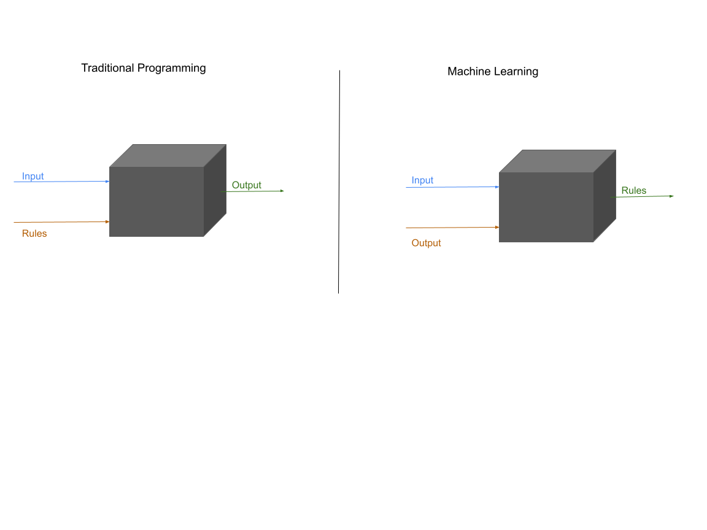
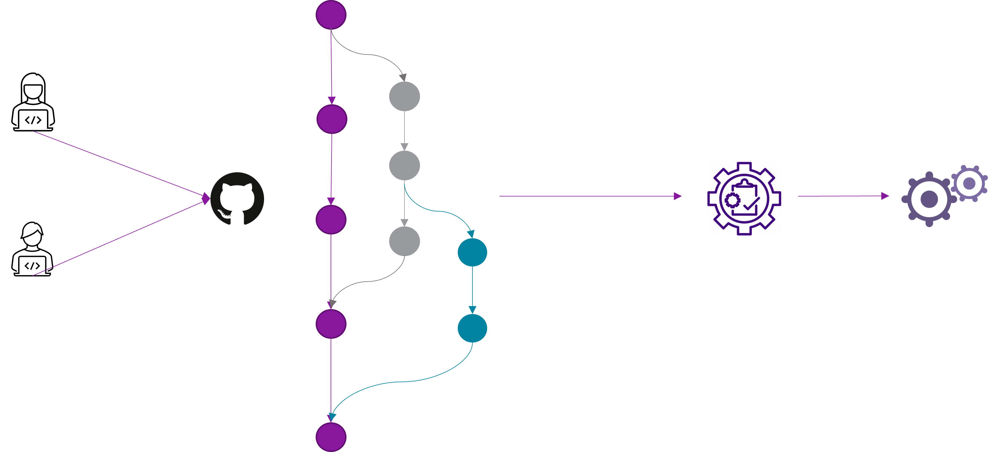
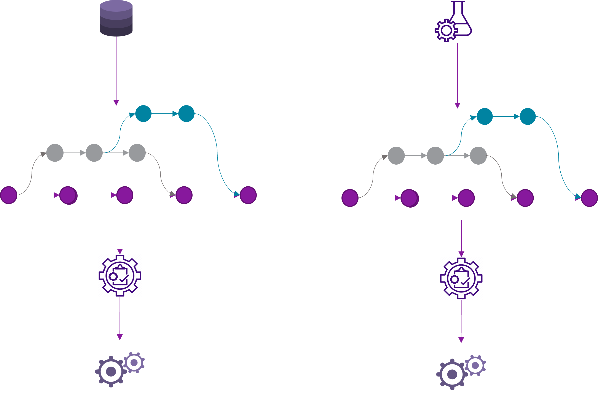
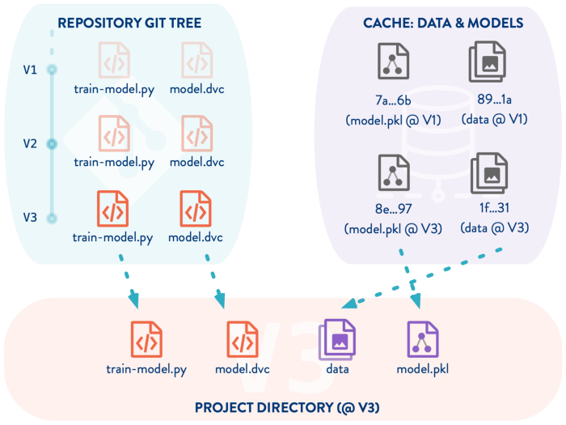
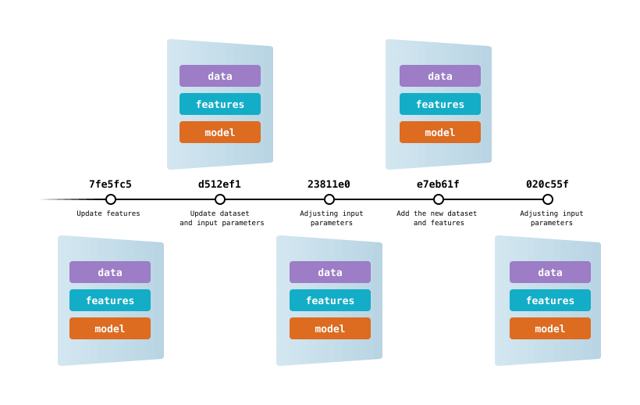
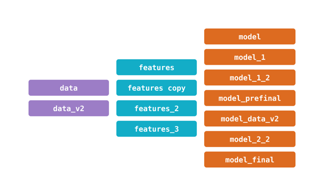

## 
  2. Data Version Control(DVC) 

## What is Version Control ?
     
Version Control is used to track and control changes to source code. It is an essential tool to ensure the integrity of the codebase. Version control facilitates a continuous, simple way to develop software.

We have many resources online available to know the importance of version control. 

## Why regular version control is not enough for ML?

## What are the challenges in using traditional git for ML projects?

In tradition code versioning,

1) Multiple developers program the requirements individually and code is versioned
2) Code will be of very small size
3) Tracking the changes in the code between the versions will be easier
4) Data will not be linked to the code

Challenges : 
1) Git do not deal well with large data files
2) Source control management systems designed to generate delta’s for text files do not deal well with changes to large binary files
3) Changes won’t always be recorded and team members might forget what was done
4) Managing multiple versions of datasets and models can be messy  

## Why not Git-LFS (Git Large File Storage)?
Git LFS lets you store files up to 2 GB in size. That is a Github limitation rather than Git-LFS limitation, however all Git-LFS implementations seem to come with various limitations.Gitlab and Atlassian both have their own lists of Git-LFS limitations. In most of the realtime cases our data size can be more than 2GB. Therefore Git-LFS on Github is probably unsuitable for machine learning.

## Data and Model Versioning using DVC

1) Versioning Data can help us in switching between different points in the history easily      
2) If we can version the data, we can write the test cases which further can be used in CI/CD pipelines

1) DVC is a data store (the DVC cache) optimized for storing and versioning large files.
2) Files managed by DVC are stored such that DVC can maintain multiple versions of each file, and to use file-system links to quickly change which version of each file is being used.
3) Conceptually the SCM (like Git) and DVC both have repositories holding multiple versions of each file. One can check out “version N” and the corresponding files will appear in the working directory, then later check out “version N+1” and the files will change around to match.

## Version Tracking
In order to have reproducibility, consistent version tracking is essential. In the traditional software world, versioning code is enough because all behavior is defined by it. 

In ML, we also need to track model versions, along with the data used to train it, and some meta-information like training hyperparameters. 

We can track models and metadata in a standard version control system like Git, but data is often too large and mutable for that to be efficient and practical. It's also important to avoid tying the model lifecycle to the code lifecycle since model training often happens on a different schedule. The common reasons when ML model and data changes are:

> The model can be retrained based upon new training data   
> Models may be retrained based on new training approaches   
> Models may be self-learning     
> Models may be deployed in a new application     
> Models may be subject to attack and require revision    
> Models might be rolled back to a previous serving version       
> Companies/Government compliance may require audit or investigation on both ML model and data, hence we need access to all versions of the productionized ML model.      
> Data may be able to reside in a restricted jurisdiction     
> Data storage may not be immutable         

## Model Validation

Standard DevOps practice is test automation, usually in the form of unit tests and integration tests. Passing these tests is a prerequisite to deploying a new version. Having a comprehensive automated test can give a team great confidence, dramatically accelerate the pace of production deployments.

ML models are harder to test because no model gives 100% correct results. This means model validation tests need to be necessarily statistical in nature, rather than having a binary pass/fail status. In order to decide whether a model is good enough for deployment, one needs to decide on the right metrics to track the threshold of their acceptable values, usually empirically, and often by comparison with previous models or benchmarks. 

    Data Version Control, or DVC, is a data and ML experiment management tool that takes advantage of the existing engineering toolset that you're already familiar with (Git, CI/CD, etc.).

    DVC can be used as a Python library, simply install it with a package manager like pip or conda. Depending on the type of remote storage you plan to use, you might need to install optional dependencies: s3, azure, gdrive, gs, oss, ssh, etc.

[Please use this link to configure DVC](https://dvc.org/doc/install)

DVC's features can be grouped into functional components:

> Data and model versioning   
Data and model access       
Data pipelines      
Metrics, parameters and plots       
Tracking Experiments     

## Similar tools in the market

mlflow, kubeflow, neptune, pachyderm etc.,

## Demo
### *Every step below is followed with a commit*
1) We will setup git and dvc to track code, data and models 
2) Setup cloud location for data to store the data
3) Add Version 1 data with 500 training records(Titanic dataset)
4) Add python code to build models
5) Train a Logistic Regression model on Version 1 data
6) Add Version 2 of the data with 800 training records
7) Train a Logistic Regression model on Version 2 data
8) Train a Random Forest model on Version 2 data
9) Switch to Version 1 of data
10) Train a Random Forest model on Version 1 data
11) Visualize everything in DVC studio

## References

1) dvc.org
2) https://builtin.com/machine-learning/mlops
3) https://towardsdatascience.com/why-git-and-git-lfs-is-not-enough-to-solve-the-machine-learning-reproducibility-crisis-f733b49e96e8