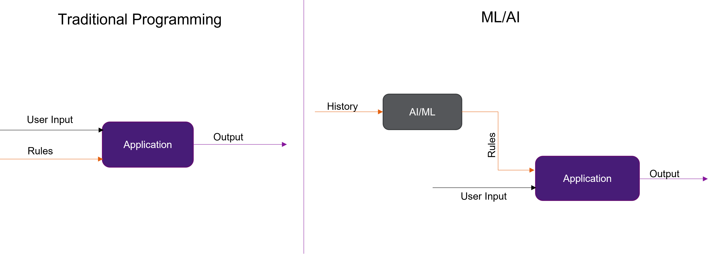

# 
 MLOPs 
 

## Table of Contents

1. Version Control   
2. Git
3. Data Version Control(DVC)
4. Unit Testing in Python

## 1. Version Control

### What is Version Control ?
     
Version Control is used to track and control changes to source code. It is an essential tool to ensure the integrity of the codebase. Version control facilitates a continuous, simple way to develop software.

We have many resources online available to know the importance of version control. 

#### Git

Git commands to get familiar with   
    
    git status
1. The git status command displays the state of the working directory and the staging area. It lets you see which changes have been staged, which haven't, and which files aren't being tracked by Git. 
2. Status output does not show you any information regarding the committed project history.
_____

    git add <filename>
    <or>
    git add .

1. This command updates the index using the current content found in the working tree, to prepare the content staged for the next commit. 
2. It typically adds the current content of existing paths as a whole, but with some options it can also be used to add content with only part of the changes made to the working tree files applied, or remove paths that do not exist in the working tree anymore.
___

    git commit -m "<message you want to add to retrack the commits>"

Create a new commit containing the current contents of the index and the given log message describing the changes.   
___

    git push origin main 
Updates remote refs using local refs, while sending objects necessary to complete the given refs.   
___  
    ## Creating new branch   
    git checkout -b <new branch name>

Creating new branches in git  
___

    ## switching to existing branch
    git checkout <branch name>
Switching to existing branches
___

    ## get all the branches from the git online repo
    git fetch --all

Fetch branches and/or tags (collectively, "refs") from one or more other repositories, along with the objects necessary to complete their histories. Remote-tracking branches are updated

###  Why is Version Control necessary?
> Backing up Code       
    
    git log
To view list of all commits

    git log --stat
To view details in logs
    
    git log --pretty=oneline
View all logs in one line

    git log --pretty=format:"%h %s" --graph

> Sharing   
> Reverting Code   

User can trace back to any commits made in the past

> Collaboration

### Why regular version control is not enough for ML?

